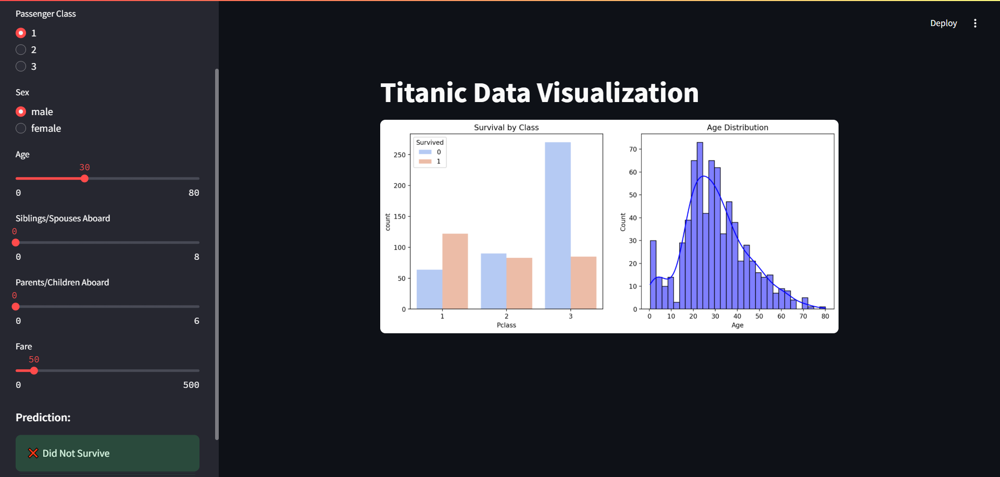

# Titanic Visualization 🚢📊


## 📌 Overview
This project provides an **interactive visualization** of Titanic dataset insights using **Streamlit**. Users can explore survival trends based on different features such as passenger class, age, gender, fare, and more.

## ✨ Features
- Interactive **survival prediction tool** 🏆
- Data visualizations (bar charts, pie charts, histograms) 📊
- Passenger demographic analysis 👥
- Filter data based on multiple criteria 🎛️
- Hosted on **Streamlit Cloud** 🌐

## 📂 Project Structure
```
📂 TitanicVisualisation_docker
│── 📄 app.py  # Main Streamlit app
│── 📄 requirements.txt  # Dependencies
│── 📄 Dockerfile  # For containerization
│── 📂 data  # Contains Titanic dataset (titanic.csv)
│── 📂 images  # Store visualization images/screenshots
│── 📄 README.md  # This file
```

## 🚀 Setup & Installation
### 1️⃣ Clone the Repository
```sh
git clone https://github.com/rajputmanav540/TitanicVisualisation_docker.git
cd TitanicVisualisation_docker
```

### 2️⃣ Install Dependencies
```sh
pip install -r requirements.txt
```

### 3️⃣ Run the Streamlit App
```sh
streamlit run app.py
```

## 📸 Screenshot


## 🌍 Deployment on Streamlit Cloud
1. Push your project to **GitHub**.
2. Go to [Streamlit Cloud](https://share.streamlit.io/).
3. Deploy the repo & get a live link! 🌐

## 🛠 Technologies Used
- **Python** 🐍
- **Streamlit** 🎈
- **Pandas** 🏷️
- **Matplotlib & Seaborn** 📊
- **Docker** 🐳 (Optional for containerization)

## 👨‍💻 Author
**Manav Rajput**  


